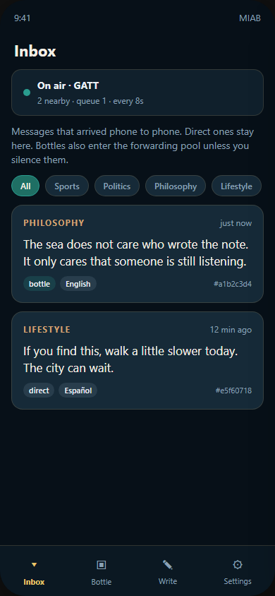
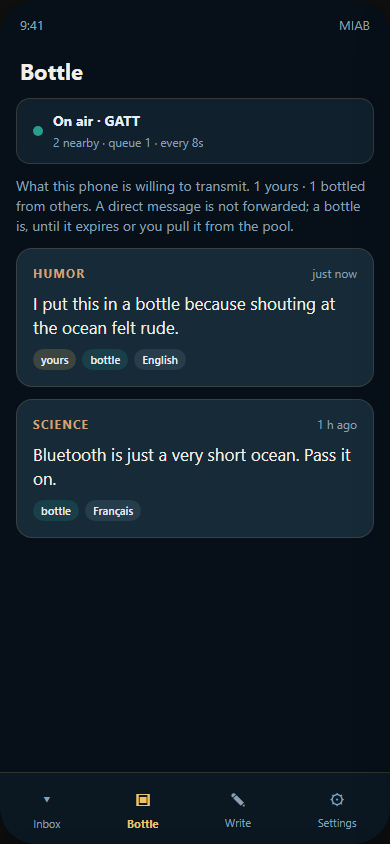
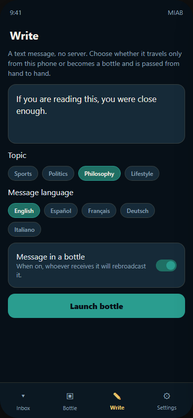
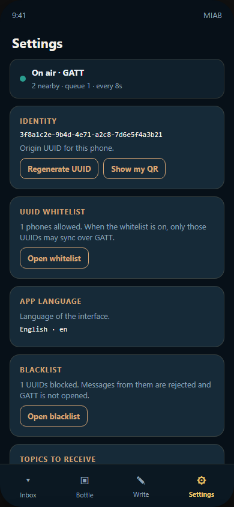
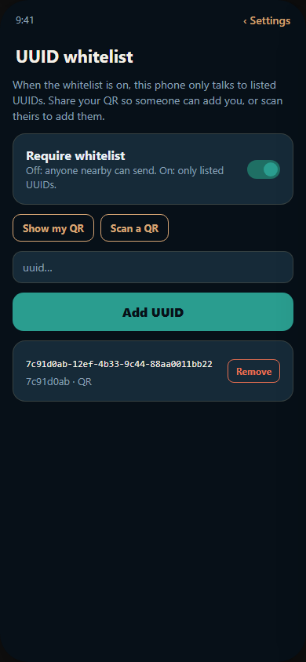
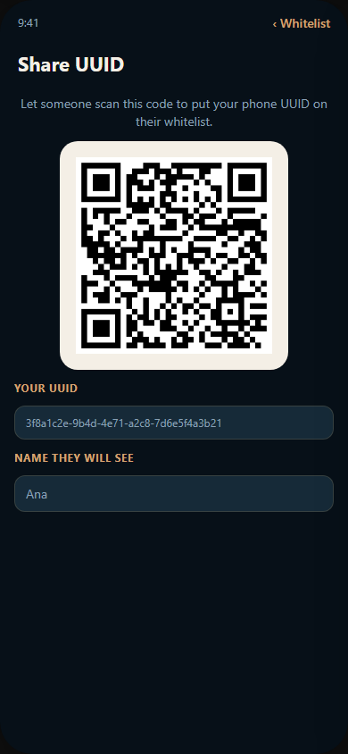
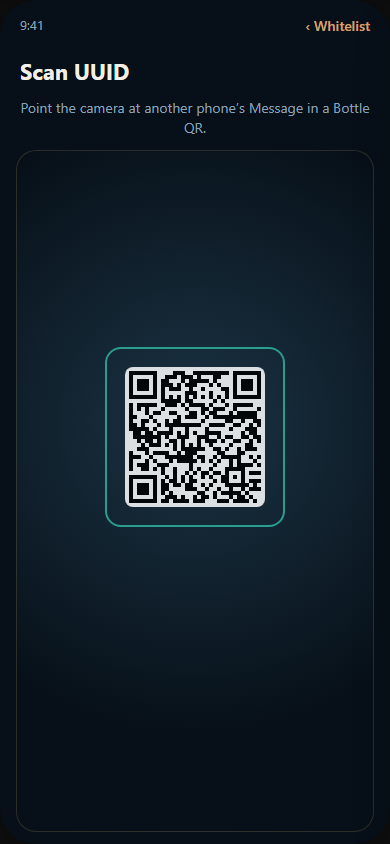
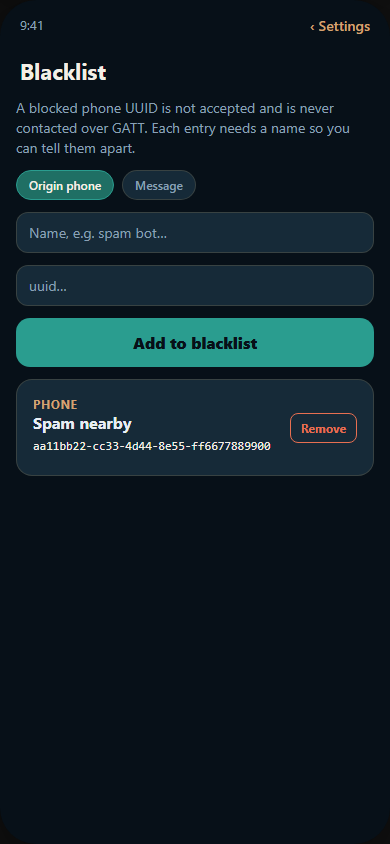

<p align="center">
  
</p>

# Message in a Bottle

Android and iPhone app for sending **text messages** between nearby phones over **Bluetooth Low Energy GATT**. There is no server and no internet: delivery is phone to phone.

<p align="center">
  
</p>

## Why I did this

This is an experiment in **free local communication**: talking to people who are actually near you, not to someone on the other side of the world.

The idea is to grow channels with a libertarian soul. If you care about control, tracking, or the footprint of current internet systems, you can still reach others — without those systems. There is no account, no cloud, no platform fee. The only cost is the battery in your pocket.

That is useful in ordinary life:

- Offer a service to neighbours while you walk the city or village: domestic cleaning, small labour, pet care, and so on. Anyone close enough can receive the message and decide if they are interested. You can include a phone number, an address, or whatever fits in the character limit.
- Create events that last an hour or a lifetime: a prior exchange before a blind date in a café or a club, with less exposure than a public profile.
- At conferences and workshops, share contacts automatically without having to stop and talk to every person.

Imagination is the only real limit. More features will come (ciphered channels and ciphered messages among them). The focus is a **wild, free local environment** that each user can leave wide open or close down — that choice belongs only to them.

## Screens

<p align="center">
  
  
  
  
</p>

<p align="center">Inbox · Bottle · Write · Settings</p>

<p align="center">
  
  
  
  
</p>

<p align="center">Whitelist · Share QR · Scan QR · Blacklist</p>

## How a message travels

Two modes, chosen when you write:

| Mode | What the receiver does |
| --- | --- |
| **Direct** | Keeps it in the inbox. **Does not** rebroadcast. Only the origin phone keeps transmitting it. |
| **Message in a bottle** | Adds it to their broadcast *pool* and forwards it to other phones they meet. |

Every message has:

- `messageId` — UUID generated when the message is created
- `originDeviceId` — UUID of the originating phone
- `language` — ISO language code of the text (en, es, fr, de, it, …)
- a topic (sports, politics, philosophy, lifestyle, science, art, humor, news, other)
- optional expiry: once it lapses, it stops being sent and forwarded

## Languages and receive filters

The interface can be switched among many app languages (English, Spanish, French, German, Italian, and dozens more). Missing UI strings fall back to English.

Incoming GATT messages are filtered **on the receiver**:

- **Languages to receive** — default is **only the app language**. You can select several languages; others are dropped.
- **Topics to receive** — default is **all topics**. Uncheck a topic (sports, politics, …) to ignore it.

Both filters are in Settings. The same filters are sent in the GATT handshake so peers do not waste airtime on content you would discard.

## UUID whitelist and QR share

By default the radio is open to any nearby phone (except the block list). You can turn on a **UUID whitelist** so this phone only syncs with listed origins.

- **Show my QR** — encodes this phone’s UUID (`miab:1:device:<uuid>`), optionally with a display name.
- **Scan a QR** — the other person scans it, **gives it a name**, and adds you to **their** whitelist (or you scan theirs).
- You can also paste a UUID by hand; a **name is required** so each entry is recognizable (and can be renamed later).

The **blacklist** still wins: a blocked UUID is never contacted, even if it is on the whitelist. Manage it in Settings → Blacklist (add/remove/rename phones or message IDs, each with a display name).

## Loop prevention and anonymity

- A message already known (same `messageId`) is ignored.
- Each install generates a phone UUID. You can **regenerate** it in Settings to drop the trail.
- UUID blacklist (phone or message, each with a name): no GATT session with a blocked origin, and that content is rejected.
- Hop cap (`maxHops`, 32) so a bottle cannot circulate forever.

## GATT radio and queue

Each phone is both **peripheral and central**:

1. Advertises the `MIAB` GATT service.
2. Scans for other nearby `MIAB` devices.
3. When many UUIDs are in range, connections are **serialized**: one GATT session at a time, with a **configurable interval in seconds** (Settings, default 8 s) and a cooldown after each sync.

Protocol (service `6d696162-74c1-4e00-8000-6d6961626f74`):

- `IDENTITY` (read) — phone UUID
- `RX` (write) — frames from the central
- `TX` (notify) — frames from the peripheral

Session: `hello` (ID catalog) → `offer` (messages you are missing + the peer catalog) → `push` (messages they are missing) → `done`.

## Screens

- **Inbox** — messages that arrived
- **Bottle** — pool this phone transmits (your own + bottled messages from others)
- **Write** — compose a message, bottle/direct mode, expiry
- **Settings** — app language, languages to receive, topics to receive, UUID whitelist and QR share, blacklist, radio, interval, accept bottles, regenerate UUID, nearby queue

On someone else’s message you can stop forwarding it or delete it. On your own you can pull it from the pool or switch it to direct.

## Requirements

- Two **physical phones** with Bluetooth. The emulator cannot do dual-role GATT.
- **Does not run in Expo Go.** You need a native development build.
- Android 12+ (`SCAN` / `CONNECT` / `ADVERTISE` permissions) or iOS 15+
- iOS builds on macOS. From Windows you can prepare the project and build Android.

On Windows, CMake/Ninja fails if paths exceed 260 characters. The `plugins/withWindowsCmake.js` plugin limits the ABI to `arm64-v8a`. The reliable fix is to enable long paths **as Administrator**:

```powershell
New-ItemProperty -Path "HKLM:\SYSTEM\CurrentControlSet\Control\FileSystem" -Name "LongPathsEnabled" -Value 1 -PropertyType DWORD -Force
git config --global core.longpaths true
```

Then: `npx expo run:android`.

JDK 17 and the Android SDK are what Expo 57 expects:

```powershell
$env:JAVA_HOME = "C:\Program Files\Eclipse Adoptium\jdk-17.0.19.10-hotspot"
$env:ANDROID_HOME = "C:\Users\Antonio\Android\Sdk"
```

## Beta releases (GitHub Actions)

A GitHub Actions pipeline builds a **sideloadable Android APK** and publishes it as a **prerelease** on GitHub.

- Workflow: `.github/workflows/beta-release.yml`
- Trigger: **Actions → Beta release → Run workflow**, or push a tag like `v1.0.0-beta.1`
- Output: [Releases](https://github.com/antonio-castellon/message-in-a-bottle/releases) with `Message-in-a-Bottle-v….apk`

The APK is signed with the debug keystore (fine for beta testers, not for Play Store). iOS is not produced by this pipeline: a signed IPA needs an Apple Developer account.

## Getting started

```powershell
cd C:\DEV.Personal\message-in-a-bottle
npm install
npx expo prebuild
npx expo run:android
```

On a Mac, `npx expo run:ios` for iPhone.

Install the same build on **two phones**, turn on Bluetooth and the radio in Settings, write a bottle on one, and bring them close. The other should show it in Inbox and, if it was a bottle, start forwarding it.

## Practical BLE limits

- Text up to 280 characters. No images, by design.
- iOS only advertises the name (`MIAB`) and the service UUID; payload travels over GATT, not in the advertisement.
- Background radio is best-effort (iOS `bluetooth-central` / `bluetooth-peripheral`; Android foreground service). If the user force-quits the app, the OS will not relaunch it.
- A sync exchanges at most 16 new messages so ATT is not flooded.
